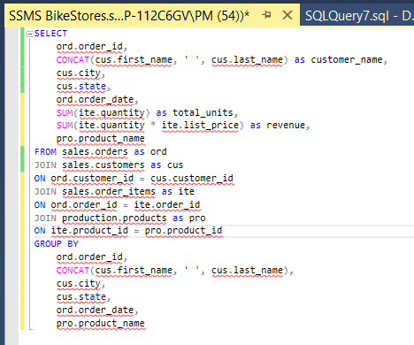
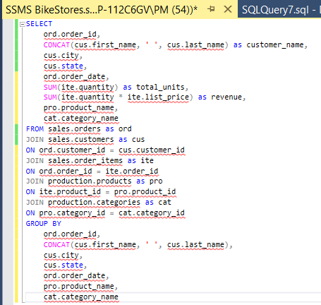
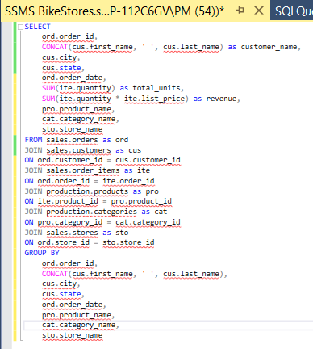
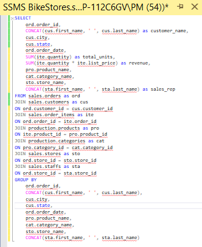

# Bike Stores Data Analysis

Thank you for reviewing my project on a hypothetical company, Busters Bikes! This project was created to showcase some of my skills in the field of data analytics and to demonstrate proficiency in the following areas: data analysis, data visualization, data manipulation, database management, and exploratory data analysis.

If you enjoy the analysis and your company is looking to add an analyst you can reach me at peige77@gmail.com

*This project will specifically focus on the following technical skills:*
- **JupyterLab**
 - **SQL using Microsoft SQL Server Management Studio**
- **Microsoft Excel**
- **Tableau**

 

**5-step approach used for this analysis:**
1. Ask and Identify Business Questions
   * Deliverables
2. Collect and Store Date
4. Clean and Prepare Data
   * SQL Queries Performed
   * Tables Generated / Joined
6. Analyze Data
   * Pivot Tables Created
   * Graphs and Charts Created
8. Visualize and Communicate Data
   * Excel Dashboard
   * Tableau Dashboard
   * Answering Business Questions

## Step One Ask and Identify Business Questions

In this hypothetical project, we'll use a strategic combination of SQL Server Management Studio, Microsoft Excel, and Tableau to systematically address the following essential business questions:

- Determining the peak revenue year for Busters Bikes, a leading bicycle retailer.
- Identifying the primary state contributing to the highest annual revenue.
- Discovering the specific months each year with the highest revenue.
- Analyzing retail outlets for consistent high revenue performance.
- Investigating product categories for consistent revenue contributions.
- Creating comprehensive lists of the top 10 revenue-generating products for each year.
- Assessing sales representatives' performance in revenue generation.
- Recognizing any client patterns to identify top purchasers.

By effectively utilizing these data analysis tools, we aim to provide insightful solutions to these crucial business inquiries.

#### Deliverables

We'll address each of these questions by crafting two distinct executive dashboards—one in Microsoft Excel and another in Tableau. These dashboards will serve as comprehensive solutions, allowing us to filter the entire dataset by year and state for each inquiry.

## Step Two Collect and Store Data

Data was taken from a publically available data set on bike stores available at [www.sqlservertutorial.net](https://www.sqlservertutorial.net/sql-server-sample-database/)

Next, a database named BikeStores was created and stored inside of Microsoft SQL Server Management Studio so that the necessary joins and queries could be performed.

## Step Three Clean And Prepare Data

Not all of our necessary data is located within one table so we will write several queries to combine the relevant data tables. This will allow us to break our query up into smaller sections to ensure accuracy.

#### Joining the first_name and last_name field

First I will combine the first_name and last_name fields into a customers_name field, and combine the sales.orders and sales.customers table by using the customer_id key.

**Query performed:**

**Table generated:**

 

#### Joining the sales.orders_items table

Next, I wanted to determine the total sales volume and the revenue generated. In order to do this we will combine the sales.order_items table with the table we just created using the key order_id and use the SUM functions. The GROUP BY clause was added at the end of the query to allow it to run properly with the functions being present.

**Query performed:**

**Table generated:**

 

#### Joining production.products table

We would also like to know the names of the products which were purchased. To add the products to our table we can JOIN the production.products table with the sales.order_items table with the product_id key.

**Query performed:**

**Table generated:**

 

#### Joining the production.categories table

Next, we will insert a column for the categories of the products that were purchased. This will be done using a JOIN on the productions.categories table with the products.productions table they key category_id.

**Query performed:**

**Table generated:**

 

#### Joining sales.stores and sales.orders tables

It would also be useful to be able to identify the store in which a particular sale took place, we can accomplish this by adding store_name to our table by using JOIN on the sales.stores and the sale.orders table with the store_id key.

**Query performed:**

**Table generated:**

 

#### Using CONCAT to combine first_name and last_name of sales reps

Finally, I will use the CONCAT function to combine the first_name and last_name of the sales rep who made the sale. 

The name data is contained in the sales.staff table. We can JOIN the sales.staff table using the staff_id field.

**Query performed**

**Table generated:**

At this point, our final table should include the following columns: order_id, customers, city, state, order_date, total_units, revenue, product_name, category_name, store_name and sales_rep.

The next step of analysis would be to clean our data to remove any redundant or unnecessary data. 

After looking at our completed table it appears that our data is largely free of redundancy.

## Step Four Analyze Data

During this stage of our project, we embark on the critical task of analyzing the data that we have acquired through our SQL queries.

_In the data importation process, we have offered two distinct approaches, each serving different needs:_

>**The first option** involves manually copying and pasting the data into an Excel workbook. This method is suitable for individuals who do not have access to a paid version of Excel.

>**The second option,** which I have chosen for this project, involves establishing a direct and dynamic connection between SQL Server Management Studio (SSMS) and Excel. This connection ensures that any modifications made in SSMS are automatically reflected in the Excel table.

In our specific project, we have opted for the second option, thus creating a seamless link between our SSMS database and Excel.

Once the data is imported, a meticulous analysis is performed to verify that the imported table precisely matches the original database in terms of the number of records, columns, and rows.

Additionally, we have prepared two supplementary sheets in our Excel workbook, aptly named "Pivot Tables" and "Dashboard," in anticipation of the forthcoming analytical processes.

**Our imported table looks like this:**

 

**Total Revenue Per Year**

This table serves as a tool for stakeholders to discern revenue trends spanning a three-year timeframe. Once the table is compiled, we employ a straightforward bar chart for illustrative purposes.

**Table and bar graph created:**

 

**Total Revenue Per Month**

This particular table enables stakeholders to track revenue patterns across a 36-month horizon. To create this pivot table, we employ the command ALT + D + P, effectively detaching from the original data source to facilitate a fresh grouping.

**Table and line graph created:**

 

**Total Revenue By State**

This table empowers stakeholders to identify the states responsible for the highest overall revenue. To visualize this data as a map chart, we initially transform our pivot table into a standard table.

**Table and map visualization created:**

 

**Total Revenue Per Store**

This table provides insights into which stores generate the most revenue.

**Table and pie chart created:**

 

**Total Revenue Per Product Category**

For an understanding of which product categories contribute the most revenue, this table proves invaluable.

**Table and bar graph created:**

 

**Total Revenue Per Product Name**

This table aids in identifying the top revenue-generating products.

**Table and bar graph created:**

 

**Total Revenue Per Sales Rep**

For discerning the highest-producing sales representatives, this table is an essential resource.

**Table and bar graph created:**

 

**Total Revenue Per Customer**

This table facilitates the identification of top merchandise purchasers among our customers.

**Table and bar graph created:**

 

In implementing these tables and accompanying visualizations, we aim to provide an accessible yet comprehensive means of extracting valuable insights from our data.

## Step Five Visualize and Communicate Data

With all the essential pivot tables and charts in place, I proceeded to seamlessly incorporate each chart into the dedicated dashboard sheet, thereby consolidating all our data into a single location.

We enhanced the functionality of the dashboard by introducing splicers, enabling stakeholders to effortlessly filter data based on date, store_id, and state.

Following some refinements to the chart and graph designs, our final executive dashboard in Excel now takes on this polished appearance.

### Excel Dashboard

 

### Tableau Dashboard

Our Tableau journey begins with a straightforward step: opening Tableau Public and establishing a connection with our Microsoft Excel spreadsheet.

Before proceeding further, we exercise due diligence by verifying the integrity of our data, ensuring it mirrors our original dataset. This step ensures that no discrepancies have arisen during the data source connection process.

With this assurance in place, our path unfolds seamlessly. We proceed to recreate the same charts in Tableau as those crafted in Excel, piecing them together into a cohesive and insightful dashboard.

Tableau offers a broader spectrum of customization options, fostering a more creative approach to data visualization.

The result is our Tableau Dashboard, a dynamic platform poised to offer fresh perspectives and insights.

**Tableau Dashboard:**

 

You can check out the final dashboard which allows you to filter by year and state by [clicking here](https://public.tableau.com/app/profile/peige.malys/viz/BikeStore_16959163551930/Dashboard2)
 

#### Answering Business Questions

If you remember back in section one we had several business questions that we wanted answered:

- Determining the peak revenue year for Busters Bikes, a leading bicycle retailer.
- Identifying the primary state contributing to the highest annual revenue.
- Discovering the specific months each year with the highest revenue.
- Analyzing retail outlets for consistent high revenue performance.
- Investigating product categories for consistent revenue contributions.
- Creating comprehensive lists of the top 10 revenue-generating products for each year.
- Assessing sales representatives' performance in revenue generation.
- Recognizing any client patterns to identify top purchasers.

While I will not be answering them directly, you can use the Tableau dashboard to quickly answer them plus many more.
